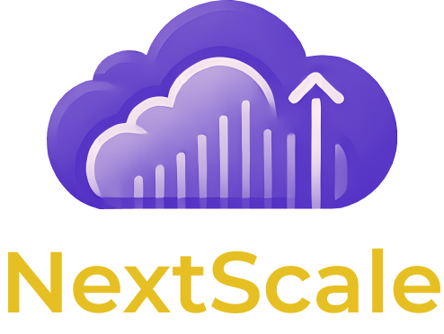

<p align="center">
  
</p>

# **Next-scale**

**Next-scale** is a production-ready, cost-efficient serverless app template designed to help developers build scalable, reliable applications on AWS without breaking the bank. Perfect for budget-conscious projects, it saves time and effort by providing a robust foundation with pre-configured integrations and enterprise-grade features.

---

## **Key Features**
- **Cost-Efficient Architecture**: Uses AWS services like Lambda (scales to zero), DynamoDB, and S3 to minimize expenses.
- **Production-Ready**: Pre-configured with CI/CD, security best practices, and scalable infrastructure.
- **Fully Serverless**: Designed for zero-maintenance deployments with seamless scalability.
- **Built for Developers**: Includes support for TypeScript, Next.js, and SST for modern development practices.

---

## **Tech Stack**
- **Frontend**: Next.js (with OpenNext)
- **Backend**: AWS Lambda, DynamoDB, PostgreSQL (if needed), and VectorDB for AI
- **Authentication**: Clerk
- **Payments**: Stripe
- **CMS**: Headless WordPress with WPGraphQL
- **AI Integration**: OpenAI API
- **Caching**: Amazon ElastiCache
- **Monitoring**: AWS CloudWatch, Sentry
- **Analytics**: Google Analytics, Google Tag Manager
- **Infrastructure**: SST, Terraform, and GitHub Actions for CI/CD

---

## **Why next-scale?**
1. **Affordable for All**: Designed for projects where users pay out of pocket or operate on limited budgets.
2. **Scalable and Flexible**: Handles everything from MVPs to enterprise-grade apps without costly overhead.
3. **Effortless Start**: Saves time with pre-configured integrations and production-ready features.
4. **No Wasteful Overheads**: Avoids costly VPCs and uses serverless components for precise scaling.

---

## **Getting Started**

### Prerequisites
- AWS Account
- Node.js (v16+)
- SST CLI (`npm install -g sst`)
- GitHub account for CI/CD setup

### Setup Instructions
1. Clone this repository:
   ```bash
   git clone https://github.com/yourusername/next-scale.git
   cd next-scale
   ```
2. Install dependencies:
   ```bash
   npm install
   ```
3. Configure AWS credentials:
   ```bash
   aws configure
   ```
4. Deploy the stack:
   ```bash
   npx sst deploy
   ```

### Development
- Start the development server:
  ```bash
  npm run dev
  ```

---

## **Features**
- **Authentication**: Seamlessly integrates with Clerk for user management.
- **AI-Powered**: Leverages OpenAI API for AI-driven features.
- **CMS**: Dynamic content delivery via WPGraphQL.
- **Payments**: Secure payments and subscriptions with Stripe.
- **Monitoring**: Pre-configured with CloudWatch and Sentry for debugging and analytics.
- **Global Delivery**: Fast content delivery with CloudFront and Route 53.

---

## **Contributing**
Contributions are welcome! Please fork the repository and submit a pull request with your improvements.

---

## **License**
This project is licensed under the MIT License. See the [LICENSE](LICENSE) file for details.
